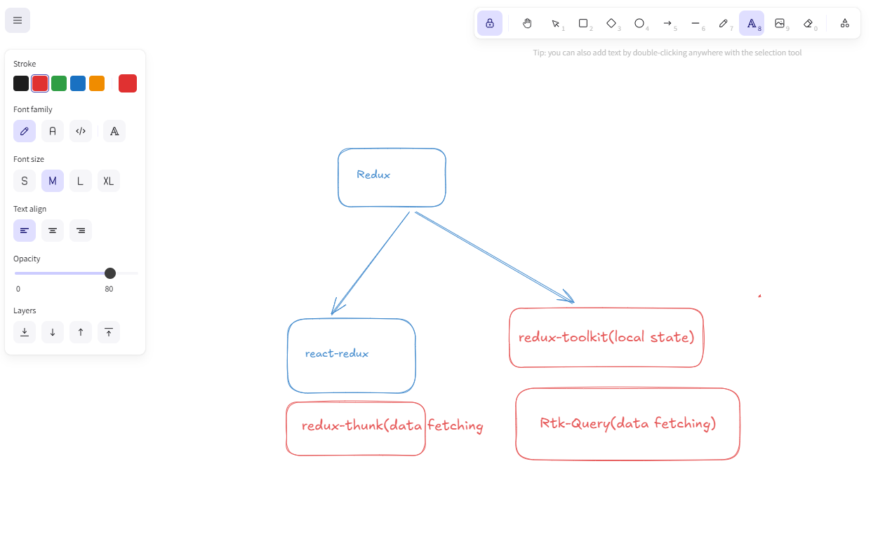
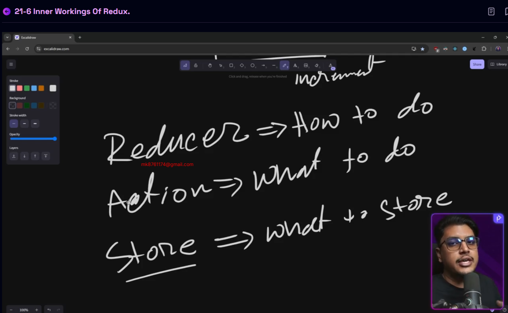
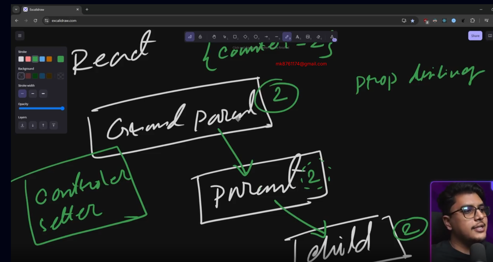
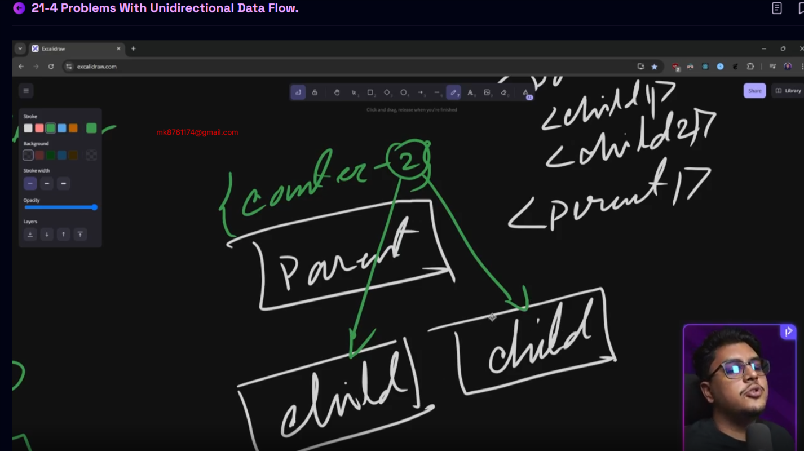
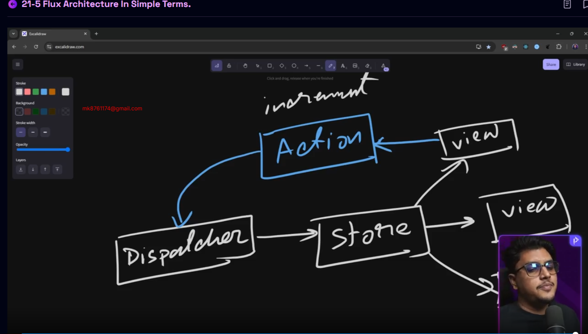
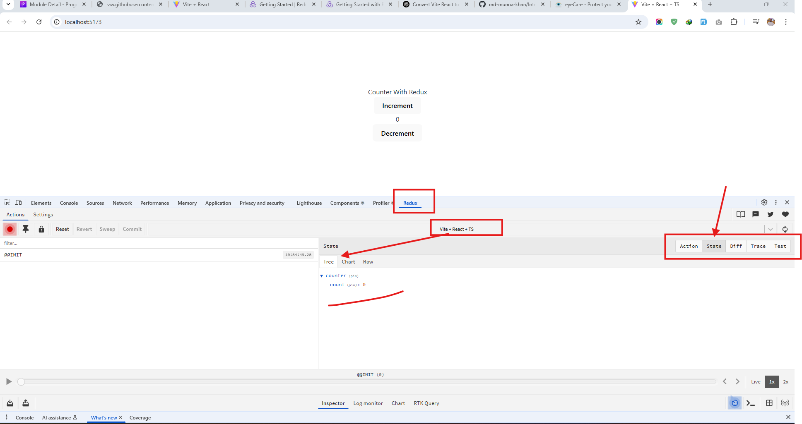

You’ve built your foundation in state management — now it’s time to wield one of the most powerful tools in the React ecosystem: Redux.


In this module, we’ll explore the why behind Redux, understand its architecture, and demystify how it works under the hood. From grasping unidirectional vs bi-directional data flow, to breaking down the Flux pattern, to setting up your first Redux store and slice — we’ve got it all covered.

💡 Whether Redux once felt too abstract or over-engineered, this module will change that.


By the end, you'll not only be able to set up and use Redux confidently but also understand exactly why and when it makes sense to use it.


Let’s begin by asking the most important question:

## 21-1 Why Redux?
- 1 Most of the popular Library and most oldest
- 2 Most of Company use Redux
- 3 more fast value generated
- 4  as a fresher must learn as like library which library use maximum company and people and thats why we choose this library


## 21-2 What Will You Learn?  
- Redux is not just for react.
- Redux can be used with any js library

#### Redux made a package named `React-Redux`
- This is made only for react. combined with wrappers

#### We will basically learn 
`redux tool kit`
- Legacy redux (old one) did not had `action` and `reduce`. we had to create it by our own.Old Redux was unopinionated 
- Whether redux tool kit is opinionated (used for local state)
- with redux tool kit we get `RTK Query`. Which is used for data fetching. In redux legacy it `Redux Thunk` was used for data fetching

## 21-3 State, Bi-directional, and uni-directional data flow.

#### What is state?
- Its present state. 
- Each user action generates a state. 
- Storing the states methods are different.
- State is a piece of information 
- State Communication can be of two types in an application 
  1. `Bidirectional` : State can flow from one component to another or from the passed component to previous component. Handling multiple component link becomes tough can create infinity loop. This is why unidirectional is best. 

  

  1. `Unidirectional` : State can pass in one direction. Redux brought unidirectional using flux 
## 21-4 Problems with unidirectional data flow.
  
  - Lets discuss a problem of unidirectional


- Lets assume a case like we have a state in grand parent. we need to use the state in children who is under parent. we need to do `prop drilling` then pass to parent(though parents has nothing to do with the sate). then parent to children the prop is passed and used.
- If there is scenario is like children has to change the state like do + or - , then we also have to pass the state change function from parent to children. 



- Suppose we have two children under a parent. from parent to children state is passed and a stet change function is there. The state change function can not be interchanged between two children. The state function needs to `state lifted` for pass to another children.


#### All these unidirectional state problem is solved by redux (because redux uses flux under the hood)
## 21-5 Flux architecture in simple terms.
- Inside Fux Architecture there will be a `store`. all the data will be stored inside the store. 
- From the store the data will be going to view. 
- View can be multiple. each are a component of react. 
- Data generated inside view need to stored inside view if we want to use in other views. but we can not directly store it because its unidirectional. 
- The unidirectional problem is solved by generating `Action`. which will help us to store the data inside `store`.
- Action(plain object) is like a request like bro i want to do this work. 
- Action uses `dispatcher` for doing this. dispatcher holds the callbacks for performing actions like registry. 
- Dispatcher sees the `request` of action and according to the action `type` dispatcher stores info to the store. 
- From `Actions` the info comes to `dispatcher` and stored the info inside store. 
- Unidirectional flow is maintained overall. 

```
User Input (View)
       ↓
Create Action (plain object)
       ↓
Dispatcher.dispatch(action)
       ↓
Store (uses registered callbacks to handle action)
       ↓
Store emits change
       ↓
View (listens to store, re-renders)

```



## 21-6 Inner workings of redux.

- In Redux there is one central store. 
- We can make multiple stores but this not a good practice. 
- The best practice is to keep one store whole redux. 
- Store contains two things 
  1. **State** : Whole application data is called state. plain object is stored inside state
  2. **Reducer** : The changes are coming to state, how would the change will come will be defined by reducer function inside reducer. Reducer has the access of the state. If any state change request comes reducer takes steps based on what is coming and changes the state with new update. 

- View is UI. View is closely connected with store(specifically with state). This is called View is `subscribed` with store. Subscribed means kind of its listening to the store. When a change comes, relevant `view` connected with `store` gets the change and updated through rendering.




- User clicks the "+" button in the View/UI (e.g., to increment a counter).
- The event triggers a dispatch of an Action like:
  
    ```js
    { type: "INCREMENT", payload: { field, value } } // here payload is for the field and the value we want to add. It may not exist.  
    ```
- The Reducer receives the Action via dispatch and updates the relevant state (e.g., count = 0 → 1) based on the `INCREMENT` type given inside dispatch.
- Reducer is holding the business logics. 
- The Store holds the new state, and the View re-renders to reflect the updated value.
- This state can also include complex nested objects like:

    ```json
    fb = { posts: [...], events: [...], messages: [...] }
    ```


#### Three things we nee to understand 

- **Reducer** : How To Do ?
- **Action** : What To Do ?
- **Store** : What to store ? 


```
User Input (View)
       ↓
dispatch(action)
       ↓
Reducer (pure function that returns new state)
       ↓
Store updates state
       ↓
View (subscribed to store, re-renders)

```


#### Difference between flux 

```
      | FLUX                      | REDUX                        |
      | ------------------------- | ---------------------------- |
      | View (User Input)         | View (User Input)            |
      | ↓                         | ↓                            |
      | Create Action             | dispatch(action)             |
      | ↓                         | ↓                            |
      | Dispatcher                | Reducer                      |
      | ↓                         | (pure function)              |
      | Store (updates state)     | ↓                            |
      | ↓                         | Store (holds state)          |
      | Store emits change        | ↓                            |
      | ↓                         | View subscribes & re-renders |
      | View listens & re-renders |

```

#### Flex 

```js
const action = { type: "ADD_TODO", payload: { text: "Buy milk" } };
Dispatcher.dispatch(action); // Dispatcher sends it to store's callback

```

#### Redux 

```js 
dispatch({ type: "ADD_TODO", payload: { text: "Buy milk" } });

```

| Term           | In **Flux**                                                              | In **Redux**                                                            |
| -------------- | ------------------------------------------------------------------------ | ----------------------------------------------------------------------- |
| **Action**     | A plain object created and sent to the **Dispatcher**                    | A plain object **directly dispatched** to the **Reducer**               |
| **Dispatcher** | A central hub that forwards the action to registered **Store callbacks** | ❌ **Does not exist**                                                    |
| **dispatch()** | Part of the **Dispatcher**, sends the Action to Stores                   | A function from Redux store that sends an **Action** to the **Reducer** |